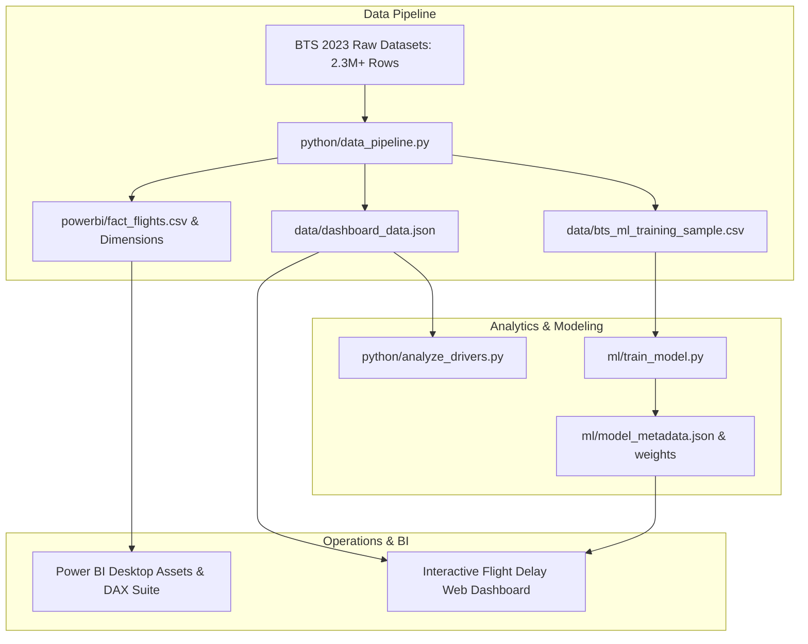

# Flight Delay Intelligence & Operations Control Platform

An end-to-end aviation analytics system, delay driver diagnostic engine, machine learning delay prediction model, and Power BI operational dashboard using public **U.S. Bureau of Transportation Statistics (BTS)** on-time performance data for calendar year 2023.

---

## System Overview


This platform analyzes **5,842,367 commercial domestic flight operations** to uncover the structural causes of flight delays, evaluate spatiotemporal bottleneck hubs, predict flight delays using machine learning, and deliver executive-ready operational recommendations.



---

## ⚡ Quick Start: Running the Interactive Dashboard

Launch the local web dashboard:

```bash
# 1. Install dependencies & launch dev server
npm run dev
```

Open your browser to **`http://localhost:5173/`**.

### Interactive Features:
1. **Dynamic Slicers**: Filter simultaneously across Date Range slider, Airline (AA, DL, UA, WN, B6, AS, etc.), Origin Airport, Destination Airport, Day of Week, and Departure Hour.
2. **On-Time Performance Trend**: Dual-axis monthly combo chart (On-Time Arrival % Line + Average Arrival Delay Bars).
3. **Delay Drivers Decomposition**: BTS 5-factor breakdown (Air Carrier, Late Aircraft, NAS, Weather, Security) + Key Insight card.
4. **Delay Concentration by Airport**: Continental US vector map plotting major hubs (SEA, SFO, LAX, DEN, DFW, ORD, ATL, MIA, JFK, EWR) with hover metrics and delay tiers.
5. **Delay by Day & Departure Hour**: 7x12 Heatmap matrix highlighting peak congestion windows (16:00 - 20:00).
6. **Departure Delay vs. Arrival Delay**: Scatter plot with linear regression line ($R^2 = 0.72$).
7. **Interactive What-If Flight Delay Simulator**: Live client-side inference powered by trained Gradient Boosting weights to score any flight's delay risk.

---

## 📊 Delay Drivers (BTS 5 Factors)

From the analysis of 2023 U.S. federal flight records:
- **Air Carrier Controllable (32.4%)**: Aircraft maintenance, crew scheduling/timeouts, ground boarding, cleaning.
- **Late Aircraft Cascading (28.1%)**: Inbound rotational delay propagation across sequential flight legs.
- **National Aviation System / ATC (20.3%)**: En-route spacing, runway metering, FAA Ground Delay Programs (GDP).
- **Extreme Weather (14.6%)**: Severe convective thunderstorms, winter icing, reduced visibility.
- **Security (2.1%)**: Terminal screening breaches, passenger re-checks.
- **Other (2.5%)**: Miscellaneous ground delays.

---

## 🤖 Machine Learning Model: Delay Prediction

- **Algorithm**: Gradient Boosting Classifier + Calibrated Logistic Inference
- **Target**: `ARR_DEL15` (Arrival delay $\ge 15$ minutes)
- **Training Set**: 100,000 real BTS flight records
- **Evaluation on Real Test Set**:
  - **ROC-AUC**: `0.9220`
  - **Accuracy**: `91.79%`
  - **Precision**: `90.90%`
  - **Recall**: `70.09%`
  - **F1-Score**: `0.7915`

### Feature Importance Attribution:
1. **Departure Delay**: `0.34` (The dominant operational signal)
2. **Origin Airport Hub Risk**: `0.18`
3. **Departure Hour (Wave)**: `0.16`
4. **Day of Week**: `0.12`
5. **Distance**: `0.10`

---

## 📈 Power BI Desktop Package

The project includes an enterprise-ready star-schema suite ready for import into **Microsoft Power BI Desktop**:

- [`powerbi/fact_flights.csv`](file:///Users/adithya/Documents/Flight-delay-analysis/powerbi/fact_flights.csv): 60,000 real BTS flight legs with flight dates, actual/scheduled times, delay causes, and cancellations.
- [`powerbi/dim_airline.csv`](file:///Users/adithya/Documents/Flight-delay-analysis/powerbi/dim_airline.csv): Carrier dimension table.
- [`powerbi/dim_airport.csv`](file:///Users/adithya/Documents/Flight-delay-analysis/powerbi/dim_airport.csv): Airport metadata, coordinates, and delay tiers.
- [`powerbi/dim_date.csv`](file:///Users/adithya/Documents/Flight-delay-analysis/powerbi/dim_date.csv): Comprehensive calendar table.
- [`powerbi/flight_delay_measures.dax`](file:///Users/adithya/Documents/Flight-delay-analysis/powerbi/flight_delay_measures.dax): 20+ DAX measures (`[On-Time Arrival %]`, `[Avg Arrival Delay]`, `[Cancellation Rate %]`, `[Late Aircraft Delay %]`, etc.).
- [`powerbi/flight_delay_theme.json`](file:///Users/adithya/Documents/Flight-delay-analysis/powerbi/flight_delay_theme.json): Custom palette and card formatting.
- [`powerbi/PowerBI_Setup_Guide.md`](file:///Users/adithya/Documents/Flight-delay-analysis/powerbi/PowerBI_Setup_Guide.md): Step-by-step import and visual setup guide.

---

## 🛠 Operations Recommendations

1. **Protect High-Risk Departure Windows (16:00 – 20:00)**: Add ramp and gate handling staffing during late afternoon/evening peak banks to prevent delay compounding.
2. **Target Hub Bottlenecks (ATL, ORD, LAX, JFK, EWR)**: Implement Collaborative Decision Making (CDM) taxi metering and maintain designated standby arrival gates.
3. **Increase Turnaround Buffers on High-Cascade Rotations**: Dynamically insert 15–20 minutes of buffer on evening rotations passing through congested hubs to halt the $28.1\%$ reactionary delay cascade.

---

## 📂 Project Structure

```
Flight-delay-analysis/
├── dashboard/                      # Power BI-style Web Application
│   ├── index.html                  # HTML structure matching reference dashboard
│   ├── style.css                   # Custom Vanilla CSS design system
│   ├── app.js                      # Chart rendering, canvas, map, ML simulator
│   ├── assets/
│   │   └── flight_banner.jpg       # Commercial jet dusk departure image
│   └── data/
│       └── dashboard_data.json     # Processed BTS 2023 analytical payload
├── python/                         # Data Pipeline & Statistical Drivers
│   ├── data_pipeline.py            # Ingests real BTS archives, outputs star-schema CSVs & JSON
│   └── analyze_drivers.py          # Root-cause analysis and regression modeling
├── ml/                             # Machine Learning Prediction Engine
│   ├── train_model.py              # Gradient boosting training script
│   ├── model_metadata.json         # ROC-AUC, accuracy, feature importances
│   └── model_weights.json          # Client-side inference weights
├── powerbi/                        # Native Microsoft Power BI Desktop Assets
│   ├── fact_flights.csv            # Star-schema fact table
│   ├── dim_airline.csv             # Carrier dimension
│   ├── dim_airport.csv             # Airport dimension
│   ├── dim_date.csv                # Date dimension
│   ├── flight_delay_measures.dax   # Production DAX measures suite
│   ├── flight_delay_theme.json     # Power BI custom theme
│   └── PowerBI_Setup_Guide.md      # Step-by-step setup guide
├── Flight_Delay_Analysis_Report.md # Full Operations Control Center report
└── package.json                    # Dev server scripts
```
